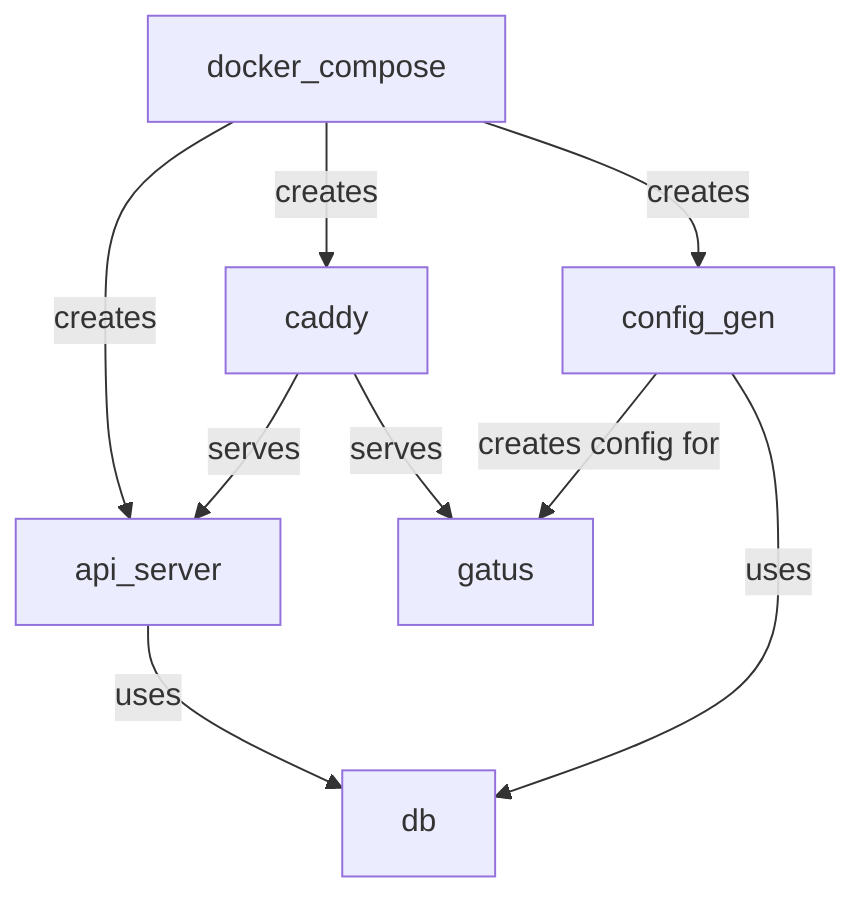

# fedi_gatus

- Utility program to pull Lemmy data and generate a Gatus YAML file

```mermaid
flowchart
docker_compose 
--creates--> api_server & caddy & config_gen

caddy 
--serves--> gatus & api_server 


api_server & config_gen 
--uses--> db

config_gen 
--creates config for--> gatus

```
