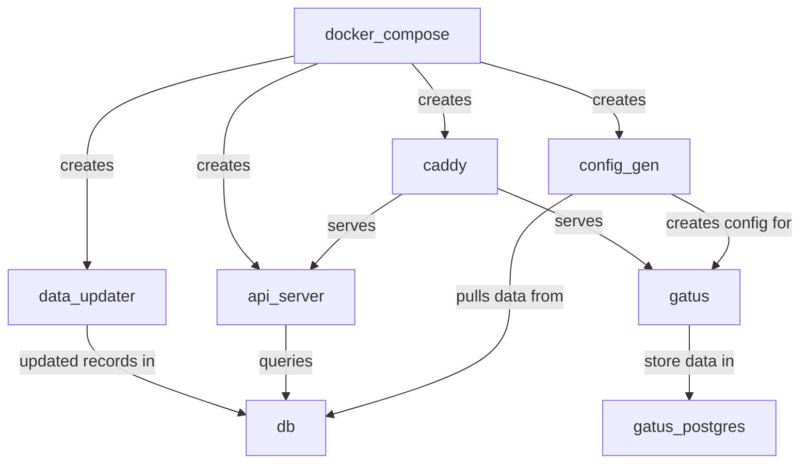

# fedi_gatus

- Utility program to pull Lemmy data and generate a Gatus YAML file
- Powers https://lemmy-status.org/
- If you have questions or problems deploying feel free to contact me via links in my GH Profile

# 🦾 Usage 🦾
** The Caddy file in this repo is just for local dev, see the cloud init script for how to run in prod
- Install gotask
- Fill out .env.example and rename to .env
- task run
- ???
- PROFIT!

# ☁ Cloud Deploy ☁
- See cloud-init.yaml.example for userdata deploy
- You will need to have docker and docker compose installed 🙃
